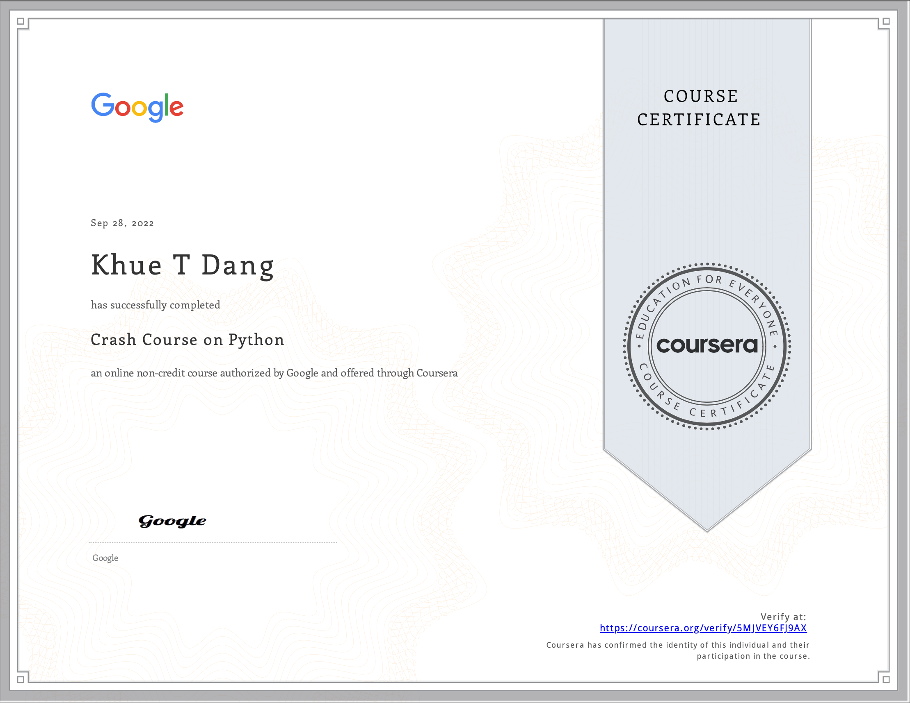

# Crash Course on Python

- This directory contains all of my assignments from the Coursera Course: [Crash Course on Python](https://www.coursera.org/learn/python-crash-course?specialization=google-it-automation&utm_source=gg&utm_medium=sem&utm_campaign=11-GoogleITwithPython-US&utm_content=B2C&campaignid=8986236679&adgroupid=119480419197&device=c&keyword=&matchtype=&network=g&devicemodel=&adpostion=&creativeid=506915205324&hide_mobile_promo&gclid=EAIaIQobChMImfrZvMy2-gIVWRvUAR0LtQUpEAAYASAAEgK9A_D_BwE)

## Table of Content

- Week 1: [Hello Python!](https://github.com/ginny100/Google-IT-Automation-with-Python/tree/master/Course%201%20-%20Crash%20Course%20on%20Python/Week%201%20-%20Hello%20Python!)
- Week 2: [Basic Python Syntax](https://github.com/ginny100/Google-IT-Automation-with-Python/tree/master/Course%201%20-%20Crash%20Course%20on%20Python/Week%202%20-%20Basic%20Python%20Syntax)
- Week 3: [Loops](https://github.com/ginny100/Google-IT-Automation-with-Python/tree/master/Course%201%20-%20Crash%20Course%20on%20Python/Week%203%20-%20Loops)
- Week 4: [Strings, Lists and Dictionaries](https://github.com/ginny100/Google-IT-Automation-with-Python/tree/master/Course%201%20-%20Crash%20Course%20on%20Python/Week%204%20-%20Strings%2C%20Lists%20and%20Dictionaries)
- Week 5: [Object Oriented Programming (Optional)](https://github.com/ginny100/Google-IT-Automation-with-Python/tree/master/Course%201%20-%20Crash%20Course%20on%20Python/Week%205%20-%20Object%20Oriented%20Programming%20(Optional))
- Week 6: [Final Project](https://github.com/ginny100/Google-IT-Automation-with-Python/tree/master/Course%201%20-%20Crash%20Course%20on%20Python/Week%206%20-%20Final%20Project)

## Proof of Completion

